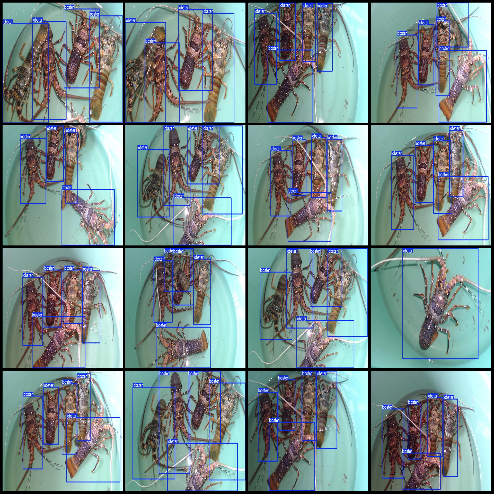
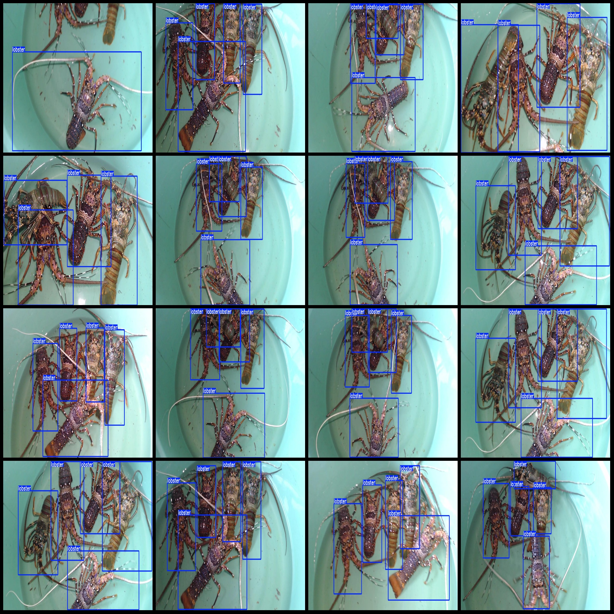

# Lobster Detection Dataset VOC+YOLO Format with 605 Images and 1 Category

**Dataset Format:** Pascal VOC format + YOLO format (without split path in the txt file, only containing jpg images along with corresponding VOC format xml files and YOLO format txt files)

**Image Count:** 605

**Annotation Count:** 605

**Annotation Count:** 605

**Annotation Category Count:** 1

**Annotation Category Name:** ["lobster"]

**Each Category's Box Count:**
- lobster (Lobster) box count = 2613
- Total boxes = 2613

**Image Resolution:** 1280x720

**Annotation Tool Used:** labelImg

**Annotation Rules:** Draw a rectangular box around the category

**Important Notes:** No specific notes provided at this time.

**Special Remarks:** This dataset does not guarantee the accuracy of the trained model or weight files.

**Image Preview:**

**Annotation Example:**

## Images

Here is a pay link on Stripe ( https://buy.stripe.com/3cs8yP7sY87d0vu9AB ). Please contact me lonlonago@foxmail.com after funding $89, and I will send you a complete data files , thank you!

